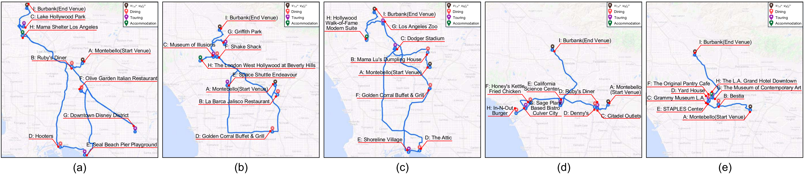
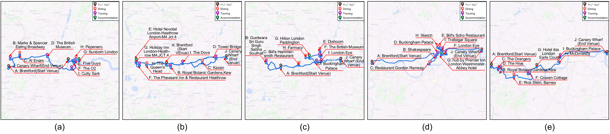

# Automatic Itinerary Planning Using Triple-Agent Deep Reinforcement Learning


This repository provides the dataset and code for the following paper:

**Paper**: Automatic Itinerary Planning Using Triple-Agent Deep Reinforcement Learning

**Authors**: Bo-Hao Chen, Jin Han, Shengxin Chen, Jia-Li Yin, Zhaojiong Chen

in [IEEE TITS](https://ieeexplore.ieee.org/document/9766177).


## Abstract
Automatic itinerary planning that provides an epic journey for each traveler is a fundamental yet inefficient task. Most existing planning methods apply heuristic guidelines for certain objective, and thereby favor popular preferred point of interests (POIs) with high probability, which ignore the intrinsic correlation between the POIs exploration, traveler's preferences, and distinctive attractions. To tackle the itinerary planning problem, this paper explores the connections of these three objectives in probabilistic manner based on a Bayesian model and proposes a triple-agent deep reinforcement learning approach, which generates 4-way direction, 4-way distance, and 3-way selection strategy for iteratively determining next POI to visit in the itinerary. Experiments on five real-world cities demonstrate that our triple-agent deep reinforcement learning approach can provide better planning results in comparison with state-of-the-art multiobjective optimization methods.

## Requirements

### Dependencies
* cuda 10.0
* cudnn 7.3.1
* Python 3.5
* xlrd==1.2.0
* geopy==1.20.0
* pymoo==0.3.2
* requests==2.22.0
* tensorflow==1.14.0
* matplotlib==3.1.1
* numpy==1.16.1
* autograd==1.3
* scikit_learn==0.21.2

### Dataset
The train image dataset can be downloaded from [here](https://pan.baidu.com/s/1pWibbJ9f5XpSFhwPR66A3g) (extraction code: vf22).

### It was tested and runs under the following OSs:
* Ubuntu 16.04
* Windows 10

Might work under others, but didn't get to test any other OSs just yet.

## Getting Started:
### Usage
* Training
```bash
$ python train.py --place=your_dataset_type
```
* Testing
```bash
$ python test.py --place=your_dataset_type --iniloc=starting_point_coordinates --endloc=terminal_point_coordinates --tottime=total_number_of_locations_traveled --Budgetlevel=your_budget_level --mytype=preferred_location_type
```

## Results


Geometric results of single-day itinerary planning in Los Angeles solved by using each compared method. (a) MOPSO method; (b) MOEA/D method; (c) NSGA-II method; (d) our previous method; and (e) our proposed method. The planning is recommended using the preference setting for u<sup>D</sup> = 1, u<sup>B</sup> = 2,
u<sup>T</sup> = {Museum, Library}, u<sup>SV</sup> = {Montebello}, and u<sup>EV</sup> = {Burbank}.



Geometric results of single-day itinerary planning in London solved by using each compared method. (a) MOPSO method; (b) MOEA/D method; (c) NSGA-II method; (d) our previous method; and (e) our proposed method. The planning is recommended using the preference setting for u<sup>D</sup> = 1, u<sup>B</sup> = 2,
u<sup>T</sup> = {Tourist Attractions}, u<sup>SV</sup> = {Brentford}, and u<sup>EV</sup> = {Canary Wharf}.  

Please refer to our [paper](https://ieeexplore.ieee.org/document/9766177) for more information. 

## License + Attribution
This code is licensed under [CC BY-NC-SA 4.0](https://creativecommons.org/licenses/by-nc-sa/4.0/). Commercial usage is not permitted. If you use this code in a scientific publication, please cite the following [paper](https://ieeexplore.ieee.org/document/9766177):
```
@ARTICLE{ChenTITS2022_TripleAgent,
  author={Chen, Bo-Hao and Han, Jin and Chen, Shengxin and Yin, Jia-Li and Chen, Zhaojiong},  
  journal={IEEE Transactions on Intelligent Transportation Systems},   
  title={Automatic Itinerary Planning Using Triple-Agent Deep Reinforcement Learning},   
  year={2022},  
  volume={23},  
  number={10},  
  pages={18864-18875},  
  doi={10.1109/TITS.2022.3169002}}
```

